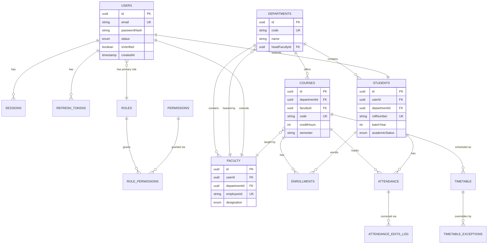
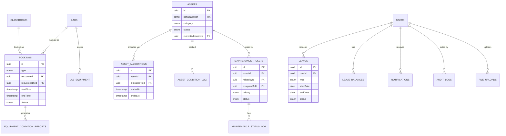
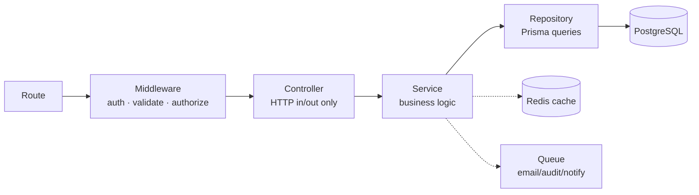
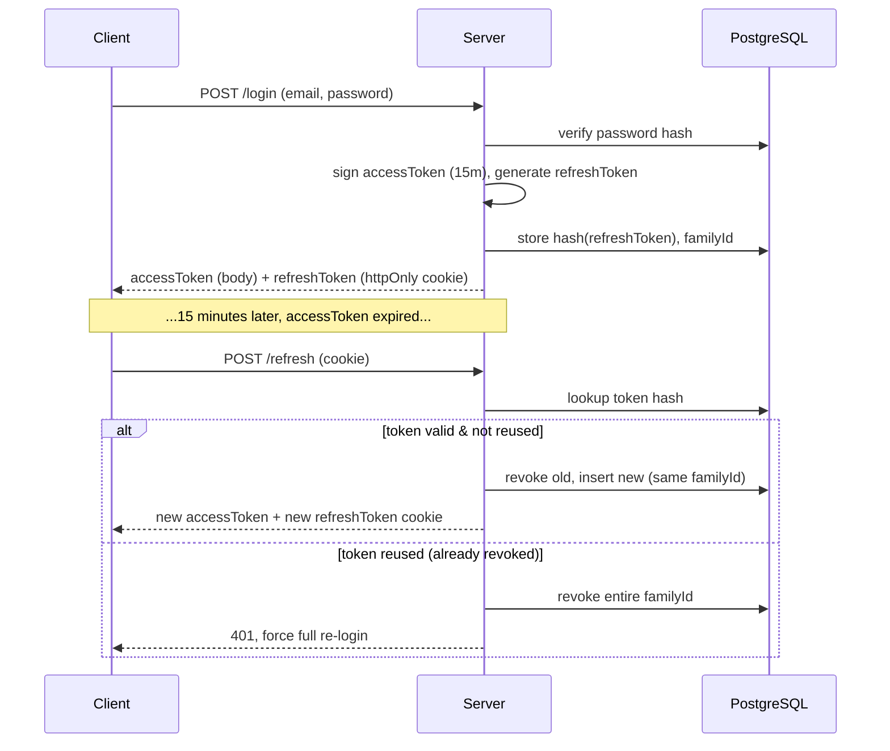

# CampusFlow ERP — Core Technical Specification
### Smart College Resource Management System

**Document type:** Functional Requirements · Database Design · API Design · Backend Architecture
**Status:** Part 1 of the full SDD/PRD (remaining sections — UI, frontend architecture, roadmap, security, testing — to follow on request)
**Stack:** Node.js · Express · TypeScript · Prisma · PostgreSQL · Redis · JWT

---

## Table of Contents

1. [Functional Requirements](#1-functional-requirements)
   1.1 Authentication · 1.2 User Management · 1.3 Role Management · 1.4 Department Management · 1.5 Course Management · 1.6 Student Management · 1.7 Faculty Management · 1.8 Attendance · 1.9 Class Scheduling · 1.10 Classroom Booking · 1.11 Laboratory Booking · 1.12 Asset Management · 1.13 Maintenance Management · 1.14 Leave Management · 1.15 Announcements · 1.16 Notifications · 1.17 Reports · 1.18 Analytics Dashboard · 1.19 Audit Logs · 1.20 Profile Management · 1.21 Settings · 1.22 Search · 1.23 File Upload · 1.24 Activity History
2. [Database Design](#2-database-design)
3. [API Design](#3-api-design)
4. [Backend Architecture](#4-backend-architecture)

Each functional module below follows a fixed template: **Purpose, Users, Features, Workflow, Validation, Edge Cases, Security, Business Rules, Success Criteria, API, DB Tables, Future**. This keeps the doc scannable and lets you jump straight to what you're building.

---

## 1. Functional Requirements

### 1.1 Authentication

**Purpose:** Verify identity and issue session credentials for every role.
**Users:** All roles (entry point to the system).
**Features:** Register (student/faculty self-signup with OTP email verification), login (email+password), logout, refresh-token rotation, forgot/reset password, OTP resend with cooldown.
**Workflow:**
1. User submits email + password → server validates format, checks uniqueness.
2. OTP generated (6-digit, 10-min expiry), emailed via queue.
3. User verifies OTP → account marked `isVerified: true`.
4. Login issues short-lived access token (15 min) + long-lived refresh token (7 days, httpOnly cookie).
5. Refresh endpoint rotates the refresh token (old one invalidated) — detects reuse as a theft signal.

**Validation:** Email format (RFC 5322), password ≥8 chars with 1 upper/lower/digit/symbol, OTP exactly 6 digits and unexpired.
**Edge Cases:** OTP expired → allow resend with 60s cooldown; refresh token reused after rotation → revoke entire token family and force re-login; concurrent login from multiple devices → allow, but track sessions per device; account not verified → block login with a clear "verify your email" response, not a generic 401.
**Security:** bcrypt (cost 12) for passwords, JWT signed with RS256 or HS256 + strong secret, refresh tokens hashed before DB storage, rate-limit login (5 attempts / 15 min / IP+email), generic error message on wrong email/password (don't reveal which was wrong).
**Business Rules:** Faculty/Admin accounts are provisioned by Admin (no self-signup); only Students self-register and require OTP verification before first login.
**Success Criteria:** >99.5% of legitimate login attempts succeed in <300ms server time; zero plaintext password/token storage.
**API:** `/api/auth/register`, `/login`, `/verify-otp`, `/resend-otp`, `/refresh`, `/logout`, `/forgot-password`, `/reset-password` (full contracts in §3).
**DB Tables:** `users`, `sessions`, `refresh_tokens`, `email_verification_tokens`, `password_reset_tokens`.
**Future:** OAuth (Google college-domain SSO), 2FA via authenticator app, device fingerprinting.

---

### 1.2 User Management

**Purpose:** Central record for every human in the system, independent of their role-specific profile (student/faculty details live in their own tables).
**Users:** Super Admin, Administrator (create/deactivate), all roles (read own record).
**Features:** Create/deactivate/reactivate user, assign role, bulk import via CSV, view user directory with filters.
**Workflow:** Admin creates user → system generates temp password → email sent → user forced to change password on first login.
**Validation:** Unique email/employee-ID/roll-number, role must exist in `roles` table, CSV import validates every row before committing any (all-or-nothing transaction).
**Edge Cases:** Deactivating a user with active bookings/assets assigned → block deactivation until reassigned, or cascade-cancel with notification; duplicate CSV rows → reject row, continue others, return per-row report.
**Security:** Only Admin/Super Admin can change roles; role changes are audit-logged; deactivated users' tokens are immediately revoked.
**Business Rules:** A user always has exactly one primary role but can hold secondary permissions (e.g., a Faculty who is also a Department Head).
**Success Criteria:** Bulk import of 500 users completes in <10s with a per-row success/failure report.
**API:** `/api/users` (CRUD), `/api/users/bulk-import`, `/api/users/:id/deactivate`.
**DB Tables:** `users`, `user_roles`.
**Future:** SCIM provisioning for institutional identity sync.

---

### 1.3 Role Management

**Purpose:** Define what each role can do — the backbone of RBAC.
**Users:** Super Admin only.
**Features:** Create custom roles, assign granular permissions per resource+action, clone an existing role, view permission matrix.
**Workflow:** Super Admin defines role → selects permissions from a resource×action grid (e.g., `asset:create`, `attendance:approve`) → role becomes assignable to users.
**Validation:** Role name unique, at least one permission required, cannot delete a role currently assigned to users.
**Edge Cases:** Deleting a role in use → block with a list of affected users; permission removed from a role mid-session → active JWTs still carry old permissions until next refresh (15-min max staleness — document this as an accepted tradeoff).
**Security:** Role/permission changes require Super Admin + are audit-logged with before/after diff.
**Business Rules:** Four system roles (Super Admin, Administrator, Faculty, Student) cannot be deleted, only extended; custom roles (e.g., "Lab Assistant", "Library Staff") are fully configurable.
**Success Criteria:** Permission check adds <5ms to request latency (in-memory cached permission set per JWT).
**API:** `/api/roles` (CRUD), `/api/roles/:id/permissions`.
**DB Tables:** `roles`, `permissions`, `role_permissions`.
**Future:** Time-bound role grants (e.g., temporary exam-duty permissions).

---

### 1.4 Department Management

**Purpose:** Organizational unit that scopes courses, faculty, and students.
**Users:** Super Admin (create), Department Head (manage own department), Admin (read all).
**Features:** CRUD departments, assign Department Head, view department roster (faculty + students + courses).
**Workflow:** Admin creates department with code (e.g., `CSE`) → assigns Head → department becomes available for course/student assignment.
**Validation:** Unique department code and name, Head must be an existing Faculty user.
**Edge Cases:** Deleting a department with active students/courses → block, require reassignment first.
**Security:** Department Head can only manage/view their own department's data (row-level scoping via `departmentId` on JWT claims).
**Business Rules:** Every Student and Faculty belongs to exactly one department.
**Success Criteria:** Department-scoped queries never leak cross-department data (verified via automated tests).
**API:** `/api/departments` (CRUD), `/api/departments/:id/roster`.
**DB Tables:** `departments`.
**Future:** Sub-departments/programs (e.g., CSE → AI specialization).

---

### 1.5 Course Management

**Purpose:** Define academic courses offered by departments.
**Users:** Department Head/Admin (CRUD), Faculty (assigned to teach), Student (enroll/view).
**Features:** CRUD course, assign teaching faculty, define credit hours and semester, link to timetable.
**Workflow:** Dept Head creates course → assigns faculty → course appears in student enrollment list for that semester.
**Validation:** Unique course code per department, credit hours >0, faculty must belong to same department (or be explicitly cross-listed).
**Edge Cases:** Removing faculty from a course mid-semester → require reassignment before removal completes; course with zero enrolled students → allowed but flagged in reports.
**Security:** Only Dept Head/Admin can create/edit courses.
**Business Rules:** A course is tied to a specific semester/academic year; historical courses are read-only once the semester ends.
**Success Criteria:** Course catalog for a department loads in <200ms even with 200+ courses.
**API:** `/api/courses` (CRUD), `/api/courses/:id/enroll`.
**DB Tables:** `courses`, `enrollments`.
**Future:** Prerequisite chains, elective credit tracking.

---

### 1.6 Student Management

**Purpose:** Student-specific profile data extending the base `users` record.
**Users:** Admin/Dept Head (CRUD), Student (read/edit own limited fields), Faculty (read own students).
**Features:** Enrollment record, roll number, batch/year, guardian contact, academic status (active/on-leave/graduated/dropped).
**Workflow:** Created automatically when Admin registers a student user → Dept Head assigns batch/section.
**Validation:** Roll number unique within department+batch, guardian phone valid format.
**Edge Cases:** Student transferring departments mid-year → preserve attendance/academic history under old department, start fresh under new.
**Security:** Student can only edit contact info, not academic fields (roll no., batch, status) — those are Admin-only.
**Business Rules:** Graduated/dropped students become read-only archives, excluded from active rosters but retained for records.
**Success Criteria:** Full student roster (5,000 records) filterable/searchable in <500ms.
**API:** `/api/students` (CRUD), `/api/students/:id/academic-history`.
**DB Tables:** `students` (extends `users`).
**Future:** Academic transcript generation, alumni portal handoff.

---

### 1.7 Faculty Management

**Purpose:** Faculty-specific profile data — designation, department, subjects taught, office hours.
**Users:** Admin/Dept Head (CRUD), Faculty (read/edit own limited fields).
**Features:** Designation (Assistant/Associate/Professor), joining date, subjects assigned, workload summary.
**Workflow:** Admin creates faculty user → Dept Head assigns to department and courses.
**Validation:** Employee ID unique, designation from a fixed enum.
**Edge Cases:** Faculty on leave with active course assignments → system flags for substitute assignment.
**Security:** Only Admin/Dept Head can change designation or department.
**Business Rules:** A faculty's total assigned weekly hours cannot exceed a configurable cap (default 20) without Admin override.
**Success Criteria:** Workload report per faculty accurate to the assigned-course level.
**API:** `/api/faculty` (CRUD), `/api/faculty/:id/workload`.
**DB Tables:** `faculty` (extends `users`).
**Future:** Performance review module, publication tracking.

---

### 1.8 Attendance

**Purpose:** Record and report per-session student attendance.
**Users:** Faculty (mark), Student (view own), Dept Head/Admin (view all, reports).
**Features:** Mark attendance per class session (present/absent/late), bulk-mark, edit-with-audit-trail, attendance percentage calculation, low-attendance alerts.
**Workflow:** Faculty opens today's scheduled class → marks each enrolled student → submits → percentage recalculated for each student.
**Validation:** Attendance can only be marked for a session that exists on the timetable and has started; cannot mark for future sessions.
**Edge Cases:** Faculty tries to edit attendance after 24 hours → require Dept Head approval for the correction (audit-logged); student added to course mid-semester → attendance % calculated only from their enrollment date forward.
**Security:** Faculty can only mark attendance for courses they teach; every edit after initial submission is logged with old/new value + editor + timestamp.
**Business Rules:** Minimum attendance threshold (default 75%) configurable per department; students below threshold flagged for the Dept Head.
**Success Criteria:** Marking attendance for a 60-student class completes in a single submit, <1s server processing.
**API:** `/api/attendance` (mark/bulk), `/api/attendance/:studentId/summary`.
**DB Tables:** `attendance`, `attendance_edits_log`.
**Future:** QR/biometric auto-marking.

---

### 1.9 Class Scheduling

**Purpose:** Build and maintain the timetable — which course meets when, where, with whom.
**Users:** Dept Head/Admin (create/edit), Faculty/Student (view own timetable).
**Features:** Weekly recurring schedule per course-section, conflict detection (faculty double-booking, room double-booking), timetable export.
**Workflow:** Dept Head assigns course to a day/time/room → system checks faculty and room availability → confirms or returns conflict.
**Validation:** No two sessions for the same faculty overlap; no two sessions for the same room overlap; session must fall within institution operating hours.
**Edge Cases:** Ad-hoc single-day reschedule → create an "exception" record rather than editing the recurring rule, so future weeks are unaffected.
**Security:** Only Dept Head/Admin can create/edit schedules.
**Business Rules:** A room's scheduled capacity cannot exceed its physical capacity (validated against `classrooms.capacity`).
**Success Criteria:** Conflict check runs in <100ms against the full department timetable.
**API:** `/api/timetable` (CRUD), `/api/timetable/conflicts`.
**DB Tables:** `timetable`, `timetable_exceptions`.
**Future:** Auto-scheduling optimizer (constraint solver).

---

### 1.10 Classroom Booking

**Purpose:** Ad-hoc reservation of classrooms outside regular timetable slots — extra classes, seminars, club events.
**Users:** Faculty/Dept Head (request), Admin (approve for shared/large rooms).
**Features:** Search available rooms by capacity/time, book, cancel, view booking calendar.
**Workflow:** User selects room + time slot → system checks against both the recurring timetable and existing bookings → auto-approves if requester is Faculty booking within their department, else routes to Admin approval.
**Validation:** Slot must not overlap timetable or existing bookings; duration within min/max limits (30min–4hr).
**Edge Cases:** Two simultaneous booking requests for the same slot → optimistic locking, first commit wins, second gets a conflict response with alternatives.
**Security:** Booking creation scoped to requester's department for self-serve; cross-department bookings require Admin approval.
**Business Rules:** Bookings auto-cancel if unconfirmed 15 minutes past start time, freeing the room.
**Success Criteria:** Availability search across 50 rooms returns in <300ms.
**API:** `/api/bookings/classrooms` (search/create/cancel).
**DB Tables:** `bookings`, `classrooms`.
**Future:** Recurring ad-hoc bookings.

---

### 1.11 Laboratory Booking

**Purpose:** Same as Classroom Booking but for labs, additionally tracking equipment/seat capacity and requiring Lab Assistant sign-off.
**Users:** Faculty (request), Lab Assistant (approve/prepare), Admin (oversight).
**Features:** Book lab with equipment requirements list, Lab Assistant checklist/prep confirmation, post-session equipment condition report.
**Workflow:** Faculty requests lab + lists required equipment → Lab Assistant reviews equipment availability → approves or flags shortage → post-session, logs equipment condition.
**Validation:** Requested equipment quantity ≤ available inventory for that lab.
**Edge Cases:** Equipment damaged mid-session → Lab Assistant raises a Maintenance ticket directly from the booking record (cross-module link).
**Security:** Only the Lab Assistant assigned to that lab can approve/prep bookings for it.
**Business Rules:** A lab booking isn't "confirmed" until Lab Assistant sign-off — unlike the auto-approve flow in classroom booking.
**Success Criteria:** 100% of lab bookings have an equipment condition report within 24 hours of session end.
**API:** `/api/bookings/labs` (search/create/approve/report).
**DB Tables:** `bookings` (type=LAB), `labs`, `lab_equipment`, `equipment_condition_reports`.
**Future:** Reservation at the item-serial-number level.

---

### 1.12 Asset Management

**Purpose:** Track every physical institutional asset — location, condition, allocation, lifecycle.
**Users:** Admin (full CRUD), Dept Head (view/request department assets), Faculty/Lab Assistant (report condition).
**Features:** Asset registry with category/tag/serial number, allocation to department/room/individual, QR-code label generation, depreciation tracking, condition history.
**Workflow:** Admin registers asset → allocates to a department/room → allocation history tracked on every reassignment → periodic condition audits logged.
**Validation:** Serial number unique, category from fixed enum, allocation target must exist.
**Edge Cases:** Asset reported lost/stolen → status changes to `MISSING`, triggers Admin notification, removed from allocatable inventory; asset reaching end-of-life → flagged for review.
**Security:** Only Admin can change asset ownership/allocation; condition reports are append-only, never overwrite history.
**Business Rules:** An asset can only be allocated to one location/person at a time; reassignment auto-closes the previous allocation record.
**Success Criteria:** Full audit trail (every allocation + condition change) reconstructable for any asset at any point in time.
**API:** `/api/assets` (CRUD), `/api/assets/:id/allocate`, `/api/assets/:id/history`.
**DB Tables:** `assets`, `asset_allocations`, `asset_condition_log`.
**Future:** RFID tracking, mobile barcode scanning.

---

### 1.13 Maintenance Management

**Purpose:** Track repair/service requests for assets, rooms, and labs.
**Users:** Any role (raise ticket), Maintenance Staff (resolve), Admin (oversight/reports).
**Features:** Raise ticket (asset/room/lab + description + priority), assign to Maintenance Staff, status pipeline (Open → In Progress → Resolved → Closed), SLA tracking.
**Workflow:** User raises ticket → Admin/auto-rule assigns to Maintenance Staff by category → staff updates status through resolution → requester confirms closure.
**Validation:** Priority from enum (Low/Medium/High/Critical), description required, linked asset/room must exist.
**Edge Cases:** Critical ticket unassigned for >2 hours → auto-escalation to Admin; ticket for an asset already flagged `MISSING` → blocked with explanatory error.
**Security:** Only assigned Maintenance Staff or Admin can change ticket status.
**Business Rules:** SLA targets configurable per priority (e.g., Critical: 4hr response, 24hr resolution); breaches logged for reporting.
**Success Criteria:** ≥95% of tickets meet their SLA target.
**API:** `/api/maintenance` (CRUD), `/api/maintenance/:id/status`.
**DB Tables:** `maintenance_tickets`, `maintenance_status_log`.
**Future:** Preventive maintenance scheduling based on asset age/usage.

---

### 1.14 Leave Management

**Purpose:** Request/approve leave for Faculty and Staff (Students use a lighter "absence excuse" variant feeding into Attendance).
**Users:** Faculty/Staff (request), Dept Head (approve), Admin (policy oversight).
**Features:** Apply for leave (type + date range + reason + attachment), approval chain, leave balance tracking, calendar view of team leave.
**Workflow:** Staff applies → routed to Dept Head → approved/rejected with comments → balance deducted on approval.
**Validation:** Date range within available balance for that leave type, no overlapping approved leave, attachment required for medical leave >2 days.
**Edge Cases:** Leave applied for a date where the staff already has an approved leave → block as duplicate; leave request spanning a semester boundary → split balance deduction across both academic years if policy requires.
**Security:** Only the Dept Head of the applicant's department can approve; Admin can override in exceptional cases (logged).
**Business Rules:** Leave types (Casual/Sick/Earned) each have separate configurable annual quotas.
**Success Criteria:** Approval decision reflected to the applicant (in-app + email) within seconds of Dept Head action.
**API:** `/api/leaves` (CRUD), `/api/leaves/:id/approve`, `/api/leaves/balance`.
**DB Tables:** `leaves`, `leave_balances`.
**Future:** Substitute-faculty auto-suggestion when leave is approved for a class day.

---

### 1.15 Announcements

**Purpose:** Broadcast institution/department-level notices.
**Users:** Admin/Dept Head/Faculty (post, scoped to their audience), all roles (read).
**Features:** Create announcement (title, body, audience scope, optional attachment, priority/pin), schedule for future publish, expiry date.
**Workflow:** Author composes → selects audience (institution-wide / department / course-specific) → publishes immediately or schedules → feeds into Notifications for the target audience.
**Validation:** Audience scope must resolve to at least one recipient; scheduled date must be in the future.
**Edge Cases:** Announcement author leaves the institution → announcement remains, attributed to "Former Faculty" rather than deleted.
**Security:** Faculty can only post to their own courses/department; institution-wide posting is Admin-only.
**Business Rules:** Pinned announcements always sort above regular ones and expire automatically at their set date.
**Success Criteria:** Published announcement reaches all in-scope users' notification feed within 5 seconds.
**API:** `/api/announcements` (CRUD).
**DB Tables:** `announcements`.
**Future:** Read-receipt tracking for mandatory notices.

---

### 1.16 Notifications

**Purpose:** Unified in-app + email delivery layer for system events (announcements, booking approvals, leave decisions, low attendance, maintenance SLA breaches, etc.).
**Users:** All roles (recipients), system (generator).
**Features:** In-app notification feed with read/unread state, per-category email opt-in/out, real-time delivery (WebSocket or polling).
**Workflow:** Any module emits an event → Notification service resolves recipients + template → writes in-app record → queues email if the user hasn't opted out of that category.
**Validation:** Notification must have a valid recipient and category.
**Edge Cases:** Recipient deactivated between event trigger and delivery → notification is discarded, not delivered to a dead account.
**Security:** Users can only read their own notifications; no cross-user access even via ID guessing (ownership check on every fetch).
**Business Rules:** Critical categories (e.g., security alerts) cannot be opted out of; informational categories can.
**Success Criteria:** 99% of in-app notifications appear within 5 seconds of the triggering event.
**API:** `/api/notifications` (list/mark-read), `/api/notifications/preferences`.
**DB Tables:** `notifications`, `notification_preferences`.
**Future:** Push notifications for a future mobile app.

---

### 1.17 Reports

**Purpose:** Generate structured, exportable reports across modules (attendance, asset utilization, maintenance SLA, leave summary).
**Users:** Dept Head/Admin primarily; Faculty for their own course reports.
**Features:** Parameterized report builder (date range, department, course filters), export to PDF/CSV, scheduled recurring reports (e.g., weekly attendance summary emailed automatically).
**Workflow:** User selects report type + filters → server aggregates data → renders as table/PDF → optionally emailed on a schedule.
**Validation:** Date range required and bounded (max 1 year per report to control query cost).
**Edge Cases:** Report requested for a department with no data in range → return an empty-but-valid report, not an error.
**Security:** Report data scoped to the requester's role/department — a Dept Head cannot pull another department's report.
**Business Rules:** Heavy reports (>10k rows) run as a background job with a completion notification rather than blocking the request.
**Success Criteria:** Standard reports (<1k rows) generate in <2s; heavy reports complete within 60s as a background job.
**API:** `/api/reports/:type`, `/api/reports/:type/export`.
**DB Tables:** Reads across existing tables; no dedicated storage beyond a `scheduled_reports` config table.
**Future:** Custom report builder UI with drag-drop fields.

---

### 1.18 Analytics Dashboard

**Purpose:** At-a-glance KPIs and trends for decision-makers.
**Users:** Admin (institution-wide), Dept Head (department-scoped).
**Features:** Attendance trend charts, asset utilization %, maintenance SLA compliance, booking occupancy rates, leave patterns.
**Workflow:** Dashboard queries pre-aggregated/cached metrics (refreshed periodically, not computed live on every page load) and renders charts.
**Validation:** N/A (read-only aggregation layer).
**Edge Cases:** New department with insufficient historical data → show "not enough data yet" state rather than a misleading empty chart.
**Security:** Metrics strictly scoped by role/department, same as Reports.
**Business Rules:** Metrics refresh on a schedule (e.g., every 15 min via a cron/Redis-cached job), not on every request, to protect DB load.
**Success Criteria:** Dashboard loads in <1s from cache under normal load.
**API:** `/api/analytics/:metric`.
**DB Tables:** Reads across existing tables; `analytics_cache` for pre-aggregated snapshots.
**Future:** Predictive analytics (e.g., attendance-risk prediction).

---

### 1.19 Audit Logs

**Purpose:** Immutable record of who did what, when — across every sensitive action in the system.
**Users:** Super Admin/Admin (read); system (write, on every mutating action of interest).
**Features:** Log entry per action (actor, action type, target entity, before/after diff, IP, timestamp), searchable/filterable log viewer.
**Workflow:** Middleware or service-layer hook captures the action after a successful mutation → writes to `audit_logs` asynchronously (doesn't block the response).
**Validation:** N/A (system-generated, not user input).
**Edge Cases:** Audit write fails (e.g., DB hiccup) → retried via queue; must never silently drop a security-relevant log entry.
**Security:** Audit logs are append-only — no update/delete API exists, even for Super Admin, to preserve integrity.
**Business Rules:** Retention period configurable (e.g., 2 years) after which logs are archived, not deleted.
**Success Criteria:** Every role change, permission change, and financial/asset reassignment has a corresponding audit entry with zero gaps.
**API:** `/api/audit-logs` (read-only, filterable).
**DB Tables:** `audit_logs`.
**Future:** Anomaly detection on audit patterns (e.g., unusual bulk deletions).

---

### 1.20 Profile Management

**Purpose:** Let users manage their own personal info, photo, and password.
**Users:** All roles (self only).
**Features:** Edit contact info, upload profile photo, change password, view own role/permissions summary.
**Workflow:** User edits allowed fields → validation → saved; password change requires current-password confirmation.
**Validation:** Photo ≤2MB, JPG/PNG only; password change requires matching current password.
**Edge Cases:** Photo upload fails mid-transfer → previous photo remains untouched (no partial overwrite).
**Security:** Users cannot edit role, department, or academic/employment fields on their own profile — those remain Admin-controlled.
**Business Rules:** Password changes invalidate all other active sessions except the current one.
**Success Criteria:** Profile updates reflected across the UI immediately without requiring re-login.
**API:** `/api/profile` (get/update), `/api/profile/photo`, `/api/profile/change-password`.
**DB Tables:** `users`.
**Future:** Two-factor authentication enrollment from the profile page.

---

### 1.21 Settings

**Purpose:** Institution-wide configuration (attendance threshold, leave quotas, SLA targets, academic year dates).
**Users:** Super Admin/Admin only.
**Features:** Key-value configuration editor, per-setting change history.
**Workflow:** Admin updates a setting → validated against its expected type/range → applied; some settings (e.g., academic year) trigger downstream jobs (archiving old-year data).
**Validation:** Each setting has a type-specific validator (number range, date, enum).
**Edge Cases:** Changing attendance threshold mid-semester → does it retroactively reflag students? Document as configurable (default: applies going forward only, not retroactive).
**Security:** Settings changes are audit-logged like any other sensitive mutation.
**Business Rules:** Some settings are read-only after certain triggers (e.g., academic year start date locks once the semester has begun).
**Success Criteria:** No invalid setting value can ever be persisted (validated server-side, not just client-side).
**API:** `/api/settings` (get/update).
**DB Tables:** `settings`, `settings_history`.
**Future:** Per-department setting overrides on top of institution defaults.

---

### 1.22 Search

**Purpose:** Fast, unified lookup across students, faculty, assets, courses, and rooms.
**Users:** All roles (results scoped to what they're permitted to see).
**Features:** Global search bar with type-ahead, filters by entity type, fuzzy matching on names/IDs.
**Workflow:** User types a query → debounced request → server searches indexed fields across permitted entities → ranked results returned.
**Validation:** Minimum 2 characters before triggering a search.
**Edge Cases:** Query matches entities the user isn't permitted to view → those results are filtered out server-side, never just hidden client-side.
**Security:** Search results always pass through the same role/department scoping as direct entity access — search is never a permission bypass.
**Business Rules:** Search indexes are limited to non-sensitive fields (name, ID, code) — never passwords, tokens, or medical/personal details.
**Success Criteria:** Type-ahead results return in <150ms for a 10k-record dataset.
**API:** `/api/search?q=`.
**DB Tables:** Reads across existing tables via indexed columns (PostgreSQL `pg_trgm`/GIN index, or an external index like Meilisearch for scale).
**Future:** Dedicated search service (Meilisearch/Elasticsearch) if dataset size demands it.

---

### 1.23 File Upload

**Purpose:** Centralized handling for all file attachments across modules (profile photos, leave attachments, maintenance photos, announcement attachments).
**Users:** All roles, scoped by module permission.
**Features:** Signed upload to cloud storage (Cloudinary), type/size validation, virus-scan hook (optional), generated thumbnail for images.
**Workflow:** Client requests a signed upload URL from the server → uploads directly to storage (not through the app server) → confirms upload → server records the file metadata linked to its parent entity.
**Validation:** Allowed MIME types per context (e.g., images only for profile photos, PDF/image for leave attachments), max size per context.
**Edge Cases:** Upload confirmed by client but file never actually lands in storage (network failure) → server verifies existence via a HEAD request before persisting the metadata record.
**Security:** Signed URLs are short-lived and scoped to a single upload; direct file access checks the same ownership/role rules as the parent entity.
**Business Rules:** Files orphaned (parent entity deleted) are cleaned up by a periodic job, not left to accumulate indefinitely.
**Success Criteria:** Zero files persisted in DB metadata without a verified corresponding object in storage.
**API:** `/api/files/upload-url`, `/api/files/:id`.
**DB Tables:** `file_uploads`.
**Future:** Client-side image compression before upload to cut storage costs.

---

### 1.24 Activity History

**Purpose:** A user-facing (not admin-only) timeline of "what happened with my stuff" — my bookings, my leave requests, my submissions — distinct from the security-focused Audit Logs.
**Users:** All roles (own history), Dept Head/Admin (department-scoped history).
**Features:** Chronological feed per entity type, filterable by date/module.
**Workflow:** Derived view over existing module tables (bookings, leaves, attendance edits) rather than a separately-written log — reduces write overhead and duplication with Audit Logs.
**Validation:** N/A (read-only derived view).
**Edge Cases:** Very active users (thousands of historical records) → paginated, indexed by `(userId, createdAt)`.
**Security:** Same ownership/department scoping as the underlying entities.
**Business Rules:** History is a read model; it never allows reverting or editing past actions from this view.
**Success Criteria:** A user's full activity timeline loads in <500ms with pagination.
**API:** `/api/activity-history`.
**DB Tables:** Composed from `bookings`, `leaves`, `attendance_edits_log`, etc. — no dedicated table.
**Future:** Exportable personal activity report (data-portability compliance).

---

## 2. Database Design

33 tables, PostgreSQL, managed via Prisma migrations. Split into two ER diagrams for readability — **Core/Academic** and **Operations** — since one 33-entity diagram is unreadable.

### 2.1 ER Diagram — Core & Academic



### 2.2 ER Diagram — Operations (Bookings · Assets · Maintenance · Leave)



### 2.3 Core Table Definitions

**`users`**
| Column | Type | Constraints |
|---|---|---|
| id | uuid | PK, default gen_random_uuid() |
| email | varchar(255) | UNIQUE, NOT NULL |
| passwordHash | varchar(255) | NOT NULL |
| primaryRoleId | uuid | FK → roles.id |
| status | enum(active, inactive, suspended) | default 'active' |
| isVerified | boolean | default false |
| photoUrl | varchar(500) | nullable |
| createdAt / updatedAt | timestamptz | default now() |

Indexes: UNIQUE(email); INDEX(primaryRoleId); INDEX(status) for admin filtering.

**`roles`** — id (PK), name (UK), isSystemRole (boolean, protects the 4 defaults from deletion), createdAt.
**`permissions`** — id (PK), resource (varchar, e.g. `asset`), action (varchar, e.g. `create`), UNIQUE(resource, action).
**`role_permissions`** — roleId (FK), permissionId (FK), composite PK(roleId, permissionId).
**`departments`** — id (PK), code (UK), name, headFacultyId (FK → faculty.id, nullable until assigned).

**`students`**
| Column | Type | Constraints |
|---|---|---|
| id | uuid | PK |
| userId | uuid | FK → users.id, UNIQUE |
| departmentId | uuid | FK → departments.id |
| rollNumber | varchar(50) | NOT NULL |
| batchYear | int | NOT NULL |
| academicStatus | enum(active, on_leave, graduated, dropped) | default 'active' |
| guardianPhone | varchar(20) | nullable |

Indexes: UNIQUE(departmentId, rollNumber); INDEX(academicStatus).

**`faculty`** — id (PK), userId (FK, UNIQUE), departmentId (FK), employeeId (UK), designation (enum), joiningDate.
**`courses`** — id (PK), departmentId (FK), facultyId (FK), code, creditHours (int), semester (varchar), UNIQUE(departmentId, code, semester).
**`enrollments`** — id (PK), courseId (FK), studentId (FK), enrolledAt, UNIQUE(courseId, studentId).
**`timetable`** — id (PK), courseId (FK), roomId (FK, polymorphic to classrooms/labs), dayOfWeek (int), startTime, endTime, UNIQUE(roomId, dayOfWeek, startTime) as the core conflict-prevention constraint.
**`timetable_exceptions`** — id (PK), timetableId (FK), exceptionDate, newRoomId (nullable), newTime (nullable), cancelled (boolean).

**`attendance`**
| Column | Type | Constraints |
|---|---|---|
| id | uuid | PK |
| courseId | uuid | FK |
| studentId | uuid | FK |
| sessionDate | date | NOT NULL |
| status | enum(present, absent, late) | NOT NULL |
| markedById | uuid | FK → faculty.id |

Indexes: UNIQUE(courseId, studentId, sessionDate) — one record per student per session; INDEX(studentId) for fast percentage rollups.
**`attendance_edits_log`** — id (PK), attendanceId (FK), oldStatus, newStatus, editedById (FK), editedAt, reason.

### 2.4 Operations Table Definitions

**`classrooms` / `labs`** — id (PK), name, capacity (int), building, floor; `labs` additionally: labAssistantId (FK).
**`lab_equipment`** — id (PK), labId (FK), name, totalQuantity (int), UNIQUE(labId, name).
**`bookings`** — id (PK), type (enum: classroom, lab), resourceId (uuid, points to classrooms.id or labs.id), requestedById (FK → users.id), startTime, endTime, status (enum: pending, approved, rejected, cancelled). Index: (resourceId, startTime, endTime) for fast overlap checks.
**`equipment_condition_reports`** — id (PK), bookingId (FK), reportedById (FK), notes, damagedItems (jsonb), reportedAt.

**`assets`**
| Column | Type | Constraints |
|---|---|---|
| id | uuid | PK |
| serialNumber | varchar(100) | UNIQUE |
| category | enum(electronics, furniture, lab_equipment, vehicle, other) | NOT NULL |
| status | enum(available, allocated, maintenance, missing, retired) | default 'available' |
| purchaseDate | date | nullable |
| currentAllocationId | uuid | FK → asset_allocations.id, nullable |

**`asset_allocations`** — id (PK), assetId (FK), allocatedToType (enum: department, room, user), allocatedToId (uuid), startedAt, endedAt (nullable — null means currently active).
**`asset_condition_log`** — id (PK), assetId (FK), reportedById (FK), condition (enum: good, fair, poor, damaged), notes, reportedAt.
**`maintenance_tickets`** — id (PK), assetId (FK, nullable if room-only issue), roomId (uuid, nullable), raisedById (FK), assignedToId (FK, nullable), priority (enum), status (enum: open, in_progress, resolved, closed), slaDeadline (timestamptz).
**`maintenance_status_log`** — id (PK), ticketId (FK), oldStatus, newStatus, changedById (FK), changedAt.
**`leaves`** — id (PK), userId (FK), type (enum: casual, sick, earned), startDate, endDate, reason (text), attachmentUrl (nullable), status (enum: pending, approved, rejected), approvedById (FK, nullable).
**`leave_balances`** — id (PK), userId (FK), leaveType (enum), totalQuota (int), used (int), academicYear (varchar), UNIQUE(userId, leaveType, academicYear).

### 2.5 Supporting Tables (compact reference)

| Table | Key Columns | Purpose |
|---|---|---|
| `sessions` | id, userId FK, deviceInfo, ipAddress, lastActiveAt | Active device sessions |
| `refresh_tokens` | id, userId FK, tokenHash, familyId, expiresAt, revoked | Rotation + reuse detection |
| `email_verification_tokens` | id, userId FK, tokenHash, expiresAt | OTP verification |
| `password_reset_tokens` | id, userId FK, tokenHash, expiresAt | Forgot-password flow |
| `user_roles` | userId FK, roleId FK | Secondary role grants (composite PK) |
| `announcements` | id, authorId FK, title, body, audienceScope (jsonb), pinned, expiresAt | Broadcasts |
| `notifications` | id, userId FK, category, title, body, readAt (nullable), createdAt | In-app feed |
| `notification_preferences` | id, userId FK, category, emailEnabled | Per-category opt-out |
| `audit_logs` | id, actorId FK, action, targetType, targetId, diff (jsonb), ipAddress, createdAt | Append-only security log |
| `file_uploads` | id, uploaderId FK, parentType, parentId, url, mimeType, sizeBytes | Centralized attachments |
| `settings` | key PK, value (jsonb), type, updatedById FK | Institution config |
| `settings_history` | id, settingKey FK, oldValue, newValue, changedById FK, changedAt | Config audit trail |
| `scheduled_reports` | id, type, filters (jsonb), cronExpression, recipientIds | Recurring report jobs |
| `analytics_cache` | id, metricKey, scope (jsonb), value (jsonb), computedAt | Pre-aggregated dashboard data |

### 2.6 Normalization & Indexing Notes

- Schema is in **3NF** — no derived/computed columns stored except `analytics_cache` (intentionally denormalized for read speed, refreshed on a schedule).
- Every FK has a corresponding index (Prisma does this automatically for relations, but composite indexes above are added explicitly via `@@index`/`@@unique` in the Prisma schema).
- `jsonb` used sparingly and only for genuinely variable-shape data (audit diffs, analytics snapshots, booking equipment lists) — not as a substitute for proper columns.
- Soft-delete pattern (`status` enums) preferred over hard deletes for `users`, `assets`, `students`, `faculty` to preserve referential integrity in historical records (attendance, allocations, audit logs). Hard deletes only for genuinely transient data (sessions, tokens).

---

## 3. API Design

REST over HTTPS, JSON bodies, versioned under `/api/v1`. Every authenticated route expects `Authorization: Bearer <accessToken>`; refresh token travels as an httpOnly cookie.

### 3.1 Common Conventions

**Response envelope (success):**
```json
{ "success": true, "data": { }, "meta": { "page": 1, "limit": 20, "total": 134 } }
```
**Response envelope (error):**
```json
{ "success": false, "error": { "code": "VALIDATION_ERROR", "message": "email is required", "fields": { "email": "required" } } }
```
**Pagination:** `?page=1&limit=20` (default 20, max 100). **Sorting:** `?sortBy=createdAt&order=desc`. **Filtering:** `?status=active&departmentId=<uuid>` — module-specific filter keys are documented per resource, not global.
**Status codes:** 200 (ok), 201 (created), 204 (deleted, no body), 400 (validation), 401 (no/invalid token), 403 (authenticated but not permitted), 404 (not found), 409 (conflict — e.g., booking overlap), 422 (semantically invalid, e.g., role in use), 429 (rate limited), 500 (server error, logged with a correlation ID returned to the client).

### 3.2 Authentication — `/api/v1/auth`

| Method | Endpoint | Auth | Description |
|---|---|---|---|
| POST | `/register` | Public | Create account, triggers OTP email |
| POST | `/verify-otp` | Public | Verify email with 6-digit OTP |
| POST | `/resend-otp` | Public | Resend OTP (60s cooldown) |
| POST | `/login` | Public | Returns access token + sets refresh cookie |
| POST | `/refresh` | Refresh cookie | Rotates refresh token, returns new access token |
| POST | `/logout` | Bearer | Revokes current refresh token family |
| POST | `/forgot-password` | Public | Emails a reset link/token |
| POST | `/reset-password` | Public (token) | Sets new password, invalidates all sessions |

### 3.3 Users, Roles, Departments — `/api/v1/{resource}`

| Method | Endpoint | Auth | Description |
|---|---|---|---|
| GET | `/users` | Admin | Paginated, filterable directory |
| POST | `/users` | Admin | Create user, sends temp password |
| POST | `/users/bulk-import` | Admin | CSV import, per-row report |
| PATCH | `/users/:id` | Admin/Self (limited fields) | Update user |
| POST | `/users/:id/deactivate` | Admin | Deactivate + revoke sessions |
| GET/POST | `/roles` | Super Admin | List/create roles |
| PUT | `/roles/:id/permissions` | Super Admin | Replace permission set |
| GET/POST/PUT/DELETE | `/departments` | Admin (write) / All (read) | Standard CRUD |
| GET | `/departments/:id/roster` | Admin/Dept Head | Faculty + students + courses |

### 3.4 Academic — Courses, Students, Faculty, Enrollment

| Method | Endpoint | Auth | Description |
|---|---|---|---|
| GET/POST/PUT | `/courses` | Dept Head/Admin | CRUD |
| POST | `/courses/:id/enroll` | Student | Self-enroll (validates prerequisites/capacity) |
| GET/PATCH | `/students` , `/students/:id` | Admin/Dept Head (write), Self (limited) | Directory + profile |
| GET | `/students/:id/academic-history` | Self/Dept Head/Admin | Enrollment + attendance timeline |
| GET/PATCH | `/faculty`, `/faculty/:id` | Admin/Dept Head (write), Self (limited) | Directory + profile |
| GET | `/faculty/:id/workload` | Self/Dept Head/Admin | Weekly hour summary |

### 3.5 Attendance & Scheduling

| Method | Endpoint | Auth | Description |
|---|---|---|---|
| POST | `/attendance/mark` | Faculty (own course) | Bulk mark for a session |
| PATCH | `/attendance/:id` | Faculty + Dept Head approval after 24h | Correction, audit-logged |
| GET | `/attendance/:studentId/summary` | Self/Faculty/Dept Head | Percentage + threshold flag |
| GET/POST | `/timetable` | Dept Head/Admin (write), All (read) | Weekly schedule |
| GET | `/timetable/conflicts` | Dept Head/Admin | Dry-run conflict check before saving |
| POST | `/timetable/:id/exceptions` | Dept Head/Admin | One-off reschedule/cancel |

### 3.6 Bookings, Assets, Maintenance

| Method | Endpoint | Auth | Description |
|---|---|---|---|
| GET | `/bookings/classrooms?date=&capacity=` | Faculty/Dept Head | Availability search |
| POST | `/bookings/classrooms` | Faculty/Dept Head | Create (auto/manual approval) |
| POST | `/bookings/labs` | Faculty | Create, requires Lab Assistant approval |
| POST | `/bookings/labs/:id/approve` | Lab Assistant | Approve + prep confirmation |
| POST | `/bookings/labs/:id/condition-report` | Lab Assistant | Post-session equipment log |
| DELETE | `/bookings/:id` | Requester/Admin | Cancel |
| GET/POST | `/assets` | Admin (write), Dept Head (read own) | Registry |
| POST | `/assets/:id/allocate` | Admin | Reassign, auto-closes previous allocation |
| GET | `/assets/:id/history` | Admin/Dept Head | Full allocation + condition timeline |
| GET/POST | `/maintenance` | Any (create), Staff (manage) | Ticket CRUD |
| PATCH | `/maintenance/:id/status` | Assigned Staff/Admin | Status transition, SLA-tracked |

### 3.7 Leave, Announcements, Notifications

| Method | Endpoint | Auth | Description |
|---|---|---|---|
| POST | `/leaves` | Faculty/Staff | Apply |
| POST | `/leaves/:id/approve` | Dept Head | Approve/reject |
| GET | `/leaves/balance` | Self | Remaining quota by type |
| GET/POST | `/announcements` | Faculty+ (write, scoped), All (read) | CRUD |
| GET | `/notifications` | Self | Paginated feed |
| PATCH | `/notifications/:id/read` | Self | Mark read |
| PUT | `/notifications/preferences` | Self | Per-category opt-out |

### 3.8 Reports, Analytics, Audit, Search, Files

| Method | Endpoint | Auth | Description |
|---|---|---|---|
| GET | `/reports/:type?from=&to=&departmentId=` | Dept Head/Admin | Sync for small ranges, async job for large |
| GET | `/reports/:type/export?format=pdf\|csv` | Dept Head/Admin | File export |
| GET | `/analytics/:metric` | Dept Head/Admin | Cached KPI data |
| GET | `/audit-logs?actor=&action=&from=&to=` | Super Admin/Admin | Read-only, filterable |
| GET | `/search?q=&type=` | All (scoped results) | Global type-ahead |
| POST | `/files/upload-url` | All (module-scoped) | Signed cloud upload URL |
| GET | `/activity-history` | Self/Dept Head/Admin | Cross-module personal timeline |

---

## 4. Backend Architecture

### 4.1 Folder Structure

```
src/
├── config/               # env loading, db client, redis client, logger setup
│   ├── env.ts
│   ├── prisma.ts         # singleton PrismaClient
│   └── redis.ts
├── modules/               # one folder per domain module (co-located, not layered globally)
│   ├── auth/
│   │   ├── auth.controller.ts
│   │   ├── auth.service.ts
│   │   ├── auth.repository.ts
│   │   ├── auth.routes.ts
│   │   ├── auth.dto.ts        # Zod schemas
│   │   └── auth.types.ts
│   ├── attendance/
│   ├── bookings/
│   ├── assets/
│   └── ...                # one per module from §1
├── middleware/
│   ├── authenticate.ts    # verifies JWT, attaches req.user
│   ├── authorize.ts       # RBAC permission check
│   ├── validate.ts        # Zod request validator
│   ├── rateLimit.ts
│   ├── errorHandler.ts    # centralized error → response mapping
│   └── auditLog.ts
├── common/
│   ├── errors/            # AppError, NotFoundError, ValidationError, ConflictError...
│   ├── utils/
│   └── queue/              # BullMQ producers/consumers (email, audit, notifications)
├── routes/
│   └── index.ts           # mounts every module's router under /api/v1
├── app.ts                 # express app, global middleware
└── server.ts               # entrypoint, graceful shutdown
```

**Why module-colocated, not layer-global** (`controllers/`, `services/`, `repositories/` as top-level folders): with 24 modules, a layer-first structure means jumping across 3 distant folders to work on one feature. Colocating by module and keeping the *pattern* consistent within each gives you the same discipline with far less navigation overhead — this scales better past ~10 modules, which CampusFlow is well beyond.

### 4.2 Layered Architecture



**Rule of thumb:** Controllers never touch Prisma directly. Services never touch `req`/`res` directly. Repositories never contain business logic (no `if` branching on business rules — just data access). This is what actually makes the layers testable in isolation.

### 4.3 Pattern in Practice — Booking Conflict Check

```typescript
// modules/bookings/bookings.repository.ts
export class BookingsRepository {
  async findOverlapping(resourceId: string, start: Date, end: Date) {
    return prisma.booking.findFirst({
      where: {
        resourceId,
        status: { in: ['pending', 'approved'] },
        AND: [
          { startTime: { lt: end } },
          { endTime: { gt: start } },
        ],
      },
    });
  }

  async create(data: CreateBookingInput) {
    return prisma.booking.create({ data });
  }
}

// modules/bookings/bookings.service.ts
export class BookingsService {
  constructor(private repo: BookingsRepository) {}

  async requestBooking(input: CreateBookingInput, requestedBy: AuthUser) {
    const overlap = await this.repo.findOverlapping(
      input.resourceId, input.startTime, input.endTime
    );
    if (overlap) {
      throw new ConflictError('This slot overlaps an existing booking', {
        conflictingBookingId: overlap.id,
      });
    }

    const status = requestedBy.role === 'FACULTY' && input.type === 'classroom'
      ? 'approved'   // auto-approve within own department
      : 'pending';

    const booking = await this.repo.create({ ...input, requestedById: requestedBy.id, status });
    await notificationQueue.add('booking-created', { bookingId: booking.id });
    return booking;
  }
}

// modules/bookings/bookings.controller.ts
export const requestBooking = async (req: Request, res: Response, next: NextFunction) => {
  try {
    const booking = await bookingsService.requestBooking(req.body, req.user);
    res.status(201).json({ success: true, data: booking });
  } catch (err) {
    next(err); // centralized errorHandler decides the status code
  }
};
```

Note the controller does exactly three things: call the service, shape the response, forward errors. No business logic leaks upward.

### 4.4 DTO Validation with Zod

```typescript
// modules/bookings/bookings.dto.ts
import { z } from 'zod';

export const createBookingSchema = z.object({
  body: z.object({
    type: z.enum(['classroom', 'lab']),
    resourceId: z.string().uuid(),
    startTime: z.coerce.date(),
    endTime: z.coerce.date(),
  }).refine(d => d.endTime > d.startTime, {
    message: 'endTime must be after startTime',
    path: ['endTime'],
  }),
});

export type CreateBookingInput = z.infer<typeof createBookingSchema>['body'];

// middleware/validate.ts
export const validate = (schema: ZodSchema) =>
  (req: Request, res: Response, next: NextFunction) => {
    const result = schema.safeParse({ body: req.body, query: req.query, params: req.params });
    if (!result.success) {
      return res.status(400).json({
        success: false,
        error: { code: 'VALIDATION_ERROR', fields: result.error.flatten().fieldErrors },
      });
    }
    req.body = result.data.body;
    next();
  };
```

### 4.5 Centralized Error Handling

```typescript
// common/errors/AppError.ts
export class AppError extends Error {
  constructor(public statusCode: number, public code: string, message: string, public details?: unknown) {
    super(message);
  }
}
export class ConflictError extends AppError {
  constructor(message: string, details?: unknown) { super(409, 'CONFLICT', message, details); }
}
export class NotFoundError extends AppError {
  constructor(entity: string) { super(404, 'NOT_FOUND', `${entity} not found`); }
}

// middleware/errorHandler.ts — last middleware in the chain
export const errorHandler = (err: unknown, req: Request, res: Response, next: NextFunction) => {
  if (err instanceof AppError) {
    return res.status(err.statusCode).json({
      success: false,
      error: { code: err.code, message: err.message, details: err.details },
    });
  }
  const correlationId = crypto.randomUUID();
  logger.error({ correlationId, err }, 'Unhandled error');
  res.status(500).json({
    success: false,
    error: { code: 'INTERNAL_ERROR', message: 'Something went wrong', correlationId },
  });
};
```

Every custom error carries an HTTP status + machine-readable code, so the handler never needs a giant `if/else` guessing what happened — this is the detail most junior REST APIs get wrong (throwing generic `Error` and mapping messages with string-matching).

### 4.6 RBAC Middleware

```typescript
// middleware/authorize.ts
export const authorize = (resource: string, action: string) =>
  (req: Request, res: Response, next: NextFunction) => {
    const userPermissions = req.user.permissions; // decoded from JWT claims, cached at login
    const allowed = userPermissions.some(p => p.resource === resource && p.action === action);
    if (!allowed) {
      return next(new AppError(403, 'FORBIDDEN', `Missing permission: ${resource}:${action}`));
    }
    next();
  };

// usage in routes
router.post('/assets/:id/allocate', authenticate, authorize('asset', 'allocate'), allocateAsset);
```

Permissions are baked into the JWT at login (not re-queried per request) for latency, with the accepted 15-minute staleness tradeoff noted in §1.3.

### 4.7 JWT + Refresh Token Rotation Flow



### 4.8 Caching, Rate Limiting, Audit, Email Queue

- **Caching (Redis):** analytics snapshots (§1.18), permission sets, and department roster lookups are cached with short TTLs (1–15 min depending on volatility). Cache keys are namespaced (`analytics:dept:{id}:attendance`) and invalidated on the relevant write, not just left to expire, wherever staleness would be user-visible.
- **Rate limiting:** `express-rate-limit` backed by Redis store (so it works correctly across multiple app instances). Stricter limits on `/auth/*` (5/15min) than general API (100/min per user).
- **Audit logging:** implemented as a queue consumer, not inline in the request path — the controller/service fires an event (`auditQueue.add(...)`), a separate worker writes to `audit_logs`. This keeps sensitive-but-non-critical-path writes from adding latency to the user-facing request, while still guaranteeing delivery via the queue's retry policy.
- **Email queue (BullMQ + Redis):** OTPs, password resets, booking approvals, and scheduled reports all go through a queue rather than sending synchronously — a slow SMTP provider should never block an API response.

### 4.9 Testing Strategy (summary — full plan in a later section)

- **Unit:** services tested with the repository mocked — this is exactly why the layered separation in §4.2 matters; you can't unit-test business logic if it's tangled with Prisma calls.
- **Integration:** repository layer tested against a real (dockerized) test PostgreSQL instance, not mocks — ORMs have enough edge-case behavior that mocking them hides bugs.
- **API/E2E:** Supertest against a running app instance for the critical paths (auth flow, booking conflict, attendance marking).

---

*This covers Functional Requirements, Database Design, API Design, and Backend Architecture. Say the word and I'll do Frontend Architecture + UI wireframes next, or Security + Testing + the 75-day Roadmap — whichever you want to build on first.*

---

## 5. Frontend Architecture

Stack: React 18 · TypeScript · Vite · Tailwind CSS · shadcn/ui · TanStack Query · Axios · React Hook Form + Zod · React Router · Recharts · TanStack Table.

### 5.1 Folder Structure

```
src/
├── app/
│   ├── routes.tsx           # route tree, lazy-loaded pages
│   ├── AppProviders.tsx     # QueryClient, AuthContext, Theme, Toaster
│   └── App.tsx
├── pages/                   # one folder per route, thin — compose from features/
│   ├── auth/ (Login, Register, ForgotPassword)
│   ├── dashboard/ (AdminDashboard, FacultyDashboard, StudentDashboard)
│   ├── attendance/
│   ├── bookings/
│   ├── assets/
│   └── ...
├── features/                 # domain logic — mirrors backend modules
│   └── attendance/
│       ├── api.ts             # axios calls + React Query hooks
│       ├── types.ts
│       ├── AttendanceGrid.tsx
│       └── useMarkAttendance.ts
├── components/
│   ├── ui/                   # shadcn primitives (button, dialog, table...)
│   ├── layout/                # Sidebar, Header, AppShell
│   └── shared/                 # StatCard, EmptyState, DataTable wrapper
├── context/
│   ├── AuthContext.tsx
│   └── ThemeContext.tsx
├── lib/
│   ├── axios.ts               # configured instance + interceptors
│   ├── queryClient.ts
│   └── utils.ts
└── hooks/
    ├── usePermission.ts
    └── useDebounce.ts
```

**Why `features/` separate from `pages/`:** pages are route-level compositions (thin — they assemble feature components + layout); features hold the actual domain logic, API hooks, and reusable pieces. This means an `AttendanceGrid` built for the Faculty page can be reused unmodified in a Dept Head's read-only report view — pages never own logic they'd need to duplicate.

### 5.2 Routing, Protected Routes, Role-Based Routes

```tsx
// app/routes.tsx
export const router = createBrowserRouter([
  { path: '/login', element: <Login /> },
  {
    element: <ProtectedRoute />,               // redirects to /login if no valid session
    children: [
      { element: <AppShell />, children: [
        { path: '/dashboard', element: <RoleDashboardRouter /> },
        {
          element: <RequireRole roles={['ADMIN', 'DEPT_HEAD']} />,
          children: [{ path: '/assets', element: <AssetList /> }],
        },
        { path: '/attendance', element: <AttendancePage /> },
      ]},
    ],
  },
]);

// components/ProtectedRoute.tsx
export function ProtectedRoute() {
  const { user, isLoading } = useAuth();
  if (isLoading) return <FullPageSpinner />;
  return user ? <Outlet /> : <Navigate to="/login" replace />;
}

// components/RequireRole.tsx
export function RequireRole({ roles }: { roles: string[] }) {
  const { user } = useAuth();
  if (!roles.includes(user!.role)) return <Navigate to="/403" replace />;
  return <Outlet />;
}
```

Route-level role gating is a UX convenience only — the real enforcement is server-side (§4.6). Never trust the client-side check as a security boundary.

### 5.3 Auth Context

```tsx
// context/AuthContext.tsx
const AuthContext = createContext<AuthState | null>(null);

export function AuthProvider({ children }: PropsWithChildren) {
  const { data: user, isLoading } = useQuery({
    queryKey: ['me'],
    queryFn: () => api.get('/profile').then(r => r.data.data),
    retry: false,
    staleTime: 5 * 60_000,
  });

  const logout = useCallback(async () => {
    await api.post('/auth/logout');
    queryClient.clear();
    window.location.href = '/login';
  }, []);

  return (
    <AuthContext.Provider value={{ user, isLoading, logout }}>
      {children}
    </AuthContext.Provider>
  );
}

export const useAuth = () => useContext(AuthContext)!;
```

Auth state is derived from a `/profile` query, not stored redundantly in local state — one source of truth, and it auto-refetches on window focus via React Query's defaults, which quietly handles the "was I logged out in another tab" case for free.

### 5.4 Axios + React Query Integration

```tsx
// lib/axios.ts
export const api = axios.create({ baseURL: '/api/v1', withCredentials: true });

let isRefreshing = false;
api.interceptors.response.use(
  res => res,
  async (error) => {
    const original = error.config;
    if (error.response?.status === 401 && !original._retry && !isRefreshing) {
      original._retry = true;
      isRefreshing = true;
      try {
        await api.post('/auth/refresh');       // cookie-based, no body needed
        return api(original);                   // replay original request
      } catch {
        window.location.href = '/login';
      } finally {
        isRefreshing = false;
      }
    }
    return Promise.reject(error);
  }
);
```

```tsx
// features/attendance/api.ts
export function useMarkAttendance(courseId: string) {
  const qc = useQueryClient();
  return useMutation({
    mutationFn: (records: AttendanceRecord[]) =>
      api.post('/attendance/mark', { courseId, records }),
    onSuccess: () => {
      qc.invalidateQueries({ queryKey: ['attendance', courseId] });
      toast.success('Attendance saved');
    },
    onError: (err) => toast.error(getErrorMessage(err)),
  });
}
```

The single 401-retry interceptor above is the entire client-side half of the refresh-rotation flow in §4.7 — one place, not scattered try/catch blocks per feature.

### 5.5 Forms — React Hook Form + Zod

```tsx
const schema = z.object({
  email: z.string().email(),
  password: z.string().min(8),
});

function LoginForm() {
  const { register, handleSubmit, formState: { errors, isSubmitting } } =
    useForm({ resolver: zodResolver(schema) });

  const onSubmit = handleSubmit(async (data) => {
    await api.post('/auth/login', data);
    navigate('/dashboard');
  });

  return (
    <form onSubmit={onSubmit}>
      <Input {...register('email')} error={errors.email?.message} />
      <Input type="password" {...register('password')} error={errors.password?.message} />
      <Button disabled={isSubmitting}>{isSubmitting ? 'Signing in…' : 'Sign in'}</Button>
    </form>
  );
}
```

Same Zod schema shape as the backend DTO in §4.4 (not literally shared code across a monorepo boundary here, but kept in sync deliberately) — validation rules never drift between client and server.

### 5.6 State Management Split

- **Server state** (anything from the API — users, bookings, attendance): TanStack Query only. No Redux, no duplicating server data into global state.
- **Client-only UI state** (sidebar collapsed, active modal, form drafts): local `useState`/`useReducer`, or React Context only when genuinely cross-cutting (auth, theme).
- This split avoids the classic mistake of syncing server data into Redux and fighting cache invalidation by hand — React Query already solves that.

### 5.7 Theming (Dark/Light)

```ts
// tailwind.config.ts — semantic tokens, not raw colors, referenced everywhere
colors: {
  background: 'hsl(var(--background))',
  foreground: 'hsl(var(--foreground))',
  primary: 'hsl(var(--primary))',
  destructive: 'hsl(var(--destructive))',
}
```
`ThemeContext` toggles a `dark` class on `<html>`; CSS variables in `:root` and `.dark` define the two palettes. Components never hardcode a color — they use the semantic token, so dark mode is a CSS-variable swap, not a per-component conditional.

### 5.8 Error Boundaries & Loading States

```tsx
<ErrorBoundary fallback={<PageError />}>
  <Suspense fallback={<PageSkeleton />}>
    <AttendancePage />
  </Suspense>
</ErrorBoundary>
```
Every route-level page is wrapped once at the router config (not per-page boilerplate). Loading states use skeleton components matching the eventual layout (not spinners) to avoid layout shift — a small detail that measurably improves perceived performance.

---

## 6. UI Design

### 6.1 UX Principles

- **Role-first, not feature-first.** Each role's dashboard leads with what they act on today (Faculty → today's classes to mark; Student → attendance risk + upcoming; Admin → pending approvals + system health) — not a generic list of every module.
- **Progressive disclosure.** List views stay dense and scannable; detail/edit forms are one click away, not inline everywhere, so tables don't turn into walls of inputs.
- **Consistent action placement.** Primary action always top-right of a page header; destructive actions always require a confirm dialog with the entity name typed back for high-stakes deletes (e.g., deleting a department).
- **Empty and error states are designed, not default.** Every list has a purpose-built empty state ("No bookings yet — search a room to get started") rather than a blank table.
- **Accessibility baseline:** semantic HTML via shadcn/ui primitives (keyboard nav + ARIA come for free), 4.5:1 minimum contrast in both themes, focus rings never suppressed.

### 6.2 App Shell (Sidebar + Header) — shared across all roles

```
┌──────────────────────────────────────────────────────────────────┐
│ ☰  CampusFlow                          🔍 Search      🔔3   👤 ▾  │  ← Header (64px)
├───────────┬──────────────────────────────────────────────────────┤
│           │                                                       │
│ 🏠 Dashboard│                                                     │
│ 📋 Attendance│                Page content renders here            │
│ 📅 Timetable │                                                     │
│ 🏢 Bookings  │                                                     │
│ 📦 Assets    │   (sidebar items shown/hidden per role permission) │
│ 🛠 Maintenance│                                                    │
│ 🌴 Leave      │                                                    │
│ 📊 Reports    │                                                    │
│ ⚙ Settings    │                                                    │
│           │                                                       │
│ [Collapse ←]│                                                     │
└───────────┴──────────────────────────────────────────────────────┘
```
Sidebar renders its item list from the user's resolved permissions (§1.3) — no role-specific sidebar components, one component filtering a config array.

### 6.3 Auth Screens

```
┌────────────────────────────────┐
│           CampusFlow             │
│                                   │
│   Email                          │
│   [_____________________]        │
│   Password                       │
│   [_____________________] 👁      │
│                                   │
│   [        Sign in        ]      │
│                                   │
│   Forgot password?               │
│   New student? Create account    │
└────────────────────────────────┘
```
Register and Forgot Password follow the identical centered-card layout — Register adds name/roll-number/department fields + OTP step; Forgot Password is a two-step (email → reset form) variant of the same card shell. Not re-wireframed separately; same component, different field set.

### 6.4 Role Dashboards

**Admin Dashboard** — system-wide pulse:
```
┌──────────────────────────────────────────────────────────┐
│  Total Students: 4,812   Faculty: 312   Pending: 14 ⚠     │
├─────────────────────┬──────────────────────────────────────┤
│  Attendance Trend     │  Pending Approvals                   │
│  (line chart, 30d)    │  • 3 bookings  • 6 leaves  • 5 tix   │
├─────────────────────┼──────────────────────────────────────┤
│  Asset Utilization %  │  Maintenance SLA Compliance          │
│  (bar chart by dept)  │  (gauge — 94%)                        │
└─────────────────────┴──────────────────────────────────────┘
```

**Faculty Dashboard** — today-focused:
```
┌──────────────────────────────────────────────────────────┐
│  Today's Classes                                            │
│  09:00 CS301 Room 204   [Mark Attendance →]                 │
│  11:00 CS204 Lab 2      [Mark Attendance →]                 │
├──────────────────────────────────────────────────────────┤
│  My Bookings (upcoming)     │  Leave Balance: 8 casual left  │
└──────────────────────────────────────────────────────────┘
```

**Student Dashboard** — status-focused:
```
┌──────────────────────────────────────────────────────────┐
│  Attendance: 82% ✅  (threshold 75%)                        │
│  CS301  91%  ████████████████░░  |  CS204  74% ⚠ ██████████░│
├──────────────────────────────────────────────────────────┤
│  Today's Timetable            │  Recent Announcements        │
└──────────────────────────────────────────────────────────┘
```

### 6.5 Key Data Screens

**Asset List** (TanStack Table — sortable, filterable, paginated):
```
┌──────────────────────────────────────────────────────────┐
│ Assets                                    [+ Add Asset]    │
│ [Search...] [Category ▾] [Status ▾] [Department ▾]         │
├──────────┬────────────┬──────────┬──────────┬─────────────┤
│ Serial # │ Category   │ Status   │ Location │ Actions      │
├──────────┼────────────┼──────────┼──────────┼─────────────┤
│ AST-0231 │ Electronics│ ● Allocated│ Lab 2  │ View ⋮       │
│ AST-0198 │ Furniture  │ ● Available│ CSE-204│ View ⋮       │
└──────────┴────────────┴──────────┴──────────┴─────────────┘
                                          ‹ 1 2 3 ... 12 ›
```

**Attendance Marking Grid** (Faculty):
```
┌──────────────────────────────────────────────────────────┐
│ CS301 — Today, 09:00                     [Mark all Present]│
├───────────┬─────────────┬──────────────────────────────────┤
│ Roll No.  │ Name        │ Status                            │
├───────────┼─────────────┼──────────────────────────────────┤
│ CSE21-045 │ A. Sharma   │ ● Present ○ Absent ○ Late          │
│ CSE21-046 │ B. Iyer     │ ○ Present ● Absent ○ Late          │
└───────────┴─────────────┴──────────────────────────────────┘
                                              [   Submit   ]
```

**Booking Calendar** (room availability search):
```
┌──────────────────────────────────────────────────────────┐
│ Book a Room     Date: [Jul 22]  Time: [2:00–3:00 PM]        │
├──────────────────────────────────────────────────────────┤
│ Room 204  (cap 60)   ● Available     [Book →]                │
│ Lab 2     (cap 30)   ✕ Conflict (CS204 until 3:30)            │
│ Room 108  (cap 40)   ● Available     [Book →]                │
└──────────────────────────────────────────────────────────┘
```

Reports, Analytics, Notifications, Settings, and Profile all reuse this same visual language — header + filter bar + `DataTable` or chart grid — deliberately, so no screen introduces a novel layout pattern a user has to relearn.

### 6.6 Responsive Behavior

- **Desktop (≥1024px):** persistent sidebar, multi-column dashboard grids as shown above.
- **Tablet (768–1023px):** sidebar collapses to icon-only by default (expandable on tap); dashboard grids drop to 2 columns.
- **Mobile (<768px):** sidebar becomes a slide-over drawer triggered by the ☰ icon; header search collapses to an icon; dashboard grids stack to 1 column; data tables switch from `<table>` to a stacked card list per row (not horizontal scroll, which is a common but poor mobile pattern):

```
┌───────────────────┐
│ ☰  CampusFlow  🔔👤 │
├───────────────────┤
│ AST-0231            │
│ Electronics          │
│ ● Allocated · Lab 2  │
│ [View]                │
├───────────────────┤
│ AST-0198             │
│ Furniture             │
│ ● Available · CSE-204 │
│ [View]                │
└───────────────────┘
```

### 6.7 Dark / Light Mode

Both themes share identical layout and component structure — only the CSS variable palette swaps (§5.7), so no separate wireframes are needed; the ASCII layouts above apply unchanged to either theme. Default follows system preference (`prefers-color-scheme`), user-overridable and persisted per-user via the Settings/Profile screens.

---

*Frontend Architecture and UI Design are done. Remaining from the original scope: Security, Testing Strategy, and the 75-day Development Roadmap — want those next?*

---

## 7. Security

### 7.1 OWASP Top 10 — Coverage Map

| Risk | Mitigation in CampusFlow |
|---|---|
| Broken Access Control | RBAC middleware on every route (§4.6) + row-level department scoping; server-side enforcement only, never trust client role checks |
| Cryptographic Failures | bcrypt (cost 12) for passwords; TLS everywhere; refresh tokens stored as hashes, never plaintext |
| Injection | Prisma parameterized queries exclusively — no raw string-concatenated SQL anywhere in the codebase |
| Insecure Design | Threat-modeled at the module level in §1 (e.g., booking race conditions, refresh-token reuse detection) |
| Security Misconfiguration | `helmet()` defaults + explicit CORS allowlist; no verbose stack traces in production error responses |
| Vulnerable Components | `npm audit` / Snyk in CI, blocks merge on high/critical CVEs |
| Auth Failures | Rate-limited login, generic error messages, refresh-token family revocation on reuse (§4.7) |
| Data Integrity Failures | Audit logs append-only (§1.19); Zod validation at every boundary, both client and server |
| Logging Failures | Structured logging (pino) with correlation IDs; security-relevant events always audit-logged, never just console output |
| SSRF | File upload uses signed direct-to-storage URLs (§1.23) — server never fetches arbitrary user-supplied URLs |

### 7.2 CSRF, XSS, Cookies

- **CSRF:** access token is sent via `Authorization` header (not a cookie the browser auto-attaches), so classic CSRF doesn't apply to authenticated API calls. The refresh token cookie is `httpOnly`, `Secure`, `SameSite=Strict` — it's never readable or sendable cross-site by design.
- **XSS:** React escapes rendered content by default; the few places that need raw HTML (announcement rich text) are sanitized server-side with a strict allowlist (`sanitize-html`) before storage, not just on render — so the stored data is safe regardless of client.
- **Cookies:** `refreshToken` is the only cookie in the system; every other piece of session state lives in memory (React Query) or the JWT payload, minimizing what's exposed to cookie-based attacks at all.

### 7.3 Headers & Transport

```typescript
// app.ts
app.use(helmet({
  contentSecurityPolicy: {
    directives: { defaultSrc: ["'self'"], imgSrc: ["'self'", 'res.cloudinary.com'] },
  },
}));
app.use(cors({
  origin: [process.env.FRONTEND_URL!],
  credentials: true, // required for the refresh cookie
}));
```
HTTPS enforced at the load balancer/reverse proxy level; HTTP requests redirected, never served.

### 7.4 Secrets & Environment

- `.env` in `.gitignore` (already established practice), secrets injected via the hosting platform's environment config in production — never committed, never logged (a `redact` list in the logger config strips `password`, `token`, `authorization` keys from any accidental log payload).
- Separate secrets per environment (dev/staging/prod) — a leaked dev JWT secret should never be able to forge a production token.

---

## 8. Testing Strategy

### 8.1 Pyramid & Tooling

| Layer | Tool | Target coverage | What it catches |
|---|---|---|---|
| Unit | Jest | 80%+ on `services/` | Business logic bugs, in isolation from DB/HTTP |
| Integration | Jest + Supertest + dockerized test PG | Every repository + critical routes | ORM/query bugs, constraint violations |
| API/E2E (backend) | Supertest | Auth flow, booking conflicts, attendance marking, RBAC denial paths | Full request→response contract |
| Frontend component | React Testing Library | Forms, protected routes, error states | UI logic bugs, regressions on user-visible behavior |
| E2E (full stack) | Playwright | 5–8 golden-path journeys (login→mark attendance, login→book room, etc.) | Integration breaks across the whole stack |

### 8.2 Example — Service Unit Test

```typescript
// bookings.service.test.ts
describe('BookingsService.requestBooking', () => {
  it('throws ConflictError when an overlapping approved booking exists', async () => {
    const repo = { findOverlapping: jest.fn().mockResolvedValue({ id: 'existing' }) };
    const service = new BookingsService(repo as any);

    await expect(
      service.requestBooking(validInput, facultyUser)
    ).rejects.toThrow(ConflictError);
    expect(repo.findOverlapping).toHaveBeenCalledWith(
      validInput.resourceId, validInput.startTime, validInput.endTime
    );
  });

  it('auto-approves classroom bookings requested by faculty', async () => {
    const repo = { findOverlapping: jest.fn().mockResolvedValue(null), create: jest.fn() };
    const service = new BookingsService(repo as any);

    await service.requestBooking({ ...validInput, type: 'classroom' }, facultyUser);

    expect(repo.create).toHaveBeenCalledWith(
      expect.objectContaining({ status: 'approved' })
    );
  });
});
```

Note this test never touches Prisma or a real database — that's the payoff of the repository injection pattern from §4.3. The equivalent integration test (below) is what actually hits Postgres.

### 8.3 Example — Integration Test

```typescript
// bookings.repository.integration.test.ts (runs against dockerized test DB)
describe('BookingsRepository.findOverlapping', () => {
  beforeEach(() => resetTestDb());

  it('detects partial overlap, not just exact match', async () => {
    await createTestBooking({ resourceId: 'room-1', startTime: '10:00', endTime: '11:00' });
    const result = await repo.findOverlapping('room-1', new Date('...10:30'), new Date('...11:30'));
    expect(result).not.toBeNull();
  });
});
```

### 8.4 CI Pipeline (GitHub Actions)

```yaml
# .github/workflows/ci.yml
name: CI
on: [pull_request]
jobs:
  test:
    runs-on: ubuntu-latest
    services:
      postgres:
        image: postgres:16
        env: { POSTGRES_PASSWORD: test }
        ports: ['5432:5432']
    steps:
      - uses: actions/checkout@v4
      - uses: actions/setup-node@v4
        with: { node-version: 20 }
      - run: npm ci
      - run: npm audit --audit-level=high
      - run: npx prisma migrate deploy
      - run: npm run test:unit
      - run: npm run test:integration
      - run: npm run lint
      - run: npm run typecheck
```
Merge is blocked if any step fails — including the `npm audit` step, which is what actually enforces the "Vulnerable Components" row in §7.1 rather than leaving it as a documentation-only promise.

---

## 9. Development Roadmap — 75 Days

11 weeks, weekly milestones. Backend-first through Week 8 so the frontend (Weeks 9–10) has real APIs to integrate against rather than mocks.

| Week | Days | Focus | Key Deliverables | Depends On |
|---|---|---|---|---|
| 1 | 1–7 | Project setup + Auth | Repo scaffold, Prisma schema v1, `/auth/*` endpoints, JWT + refresh rotation, CI pipeline skeleton | — |
| 2 | 8–14 | Users, Roles, Departments | RBAC engine (§1.3), user CRUD + bulk import, department CRUD | Week 1 |
| 3 | 15–21 | Academic core | Courses, Students, Faculty modules, enrollment flow | Week 2 |
| 4 | 22–28 | Attendance + Scheduling | Timetable CRUD + conflict detection, attendance marking + edit audit trail | Week 3 |
| 5 | 29–35 | Bookings | Classroom booking (auto-approve), Lab booking (Lab Assistant approval + equipment), overlap-conflict handling | Week 4 |
| 6 | 36–42 | Assets + Maintenance | Asset registry + allocation history, maintenance ticket pipeline + SLA tracking | Week 2 |
| 7 | 43–49 | Leave, Announcements, Notifications | Leave request/approval + balances, announcements, notification service + email queue | Week 2 |
| 8 | 50–56 | Reports, Analytics, Audit, Search, Files | Report generation (sync + async job), analytics cache jobs, audit log pipeline, global search, file upload service | Weeks 1–7 (reads across all modules) |
| 9 | 57–63 | Frontend core | Auth pages, app shell (sidebar/header), protected/role routing, Axios+React Query setup, all 3 role dashboards | Week 8 (needs stable APIs) |
| 10 | 64–70 | Frontend feature screens | Attendance grid, booking calendar, asset list, reports/analytics views, settings/profile, responsive pass | Week 9 |
| 11 | 71–75 | Hardening + launch | Security review against §7 checklist, E2E test suite (Playwright), load test critical endpoints, deployment + rollback plan, buffer for fixes | Weeks 1–10 |

**Parallelization note:** Weeks 2–8 are backend-only and largely independent per module (e.g., Assets/Maintenance in Week 6 don't block on Leave/Announcements in Week 7) — with 2+ backend developers, Weeks 2–8 compress to roughly 4–5 weeks by splitting modules across people, pulling the whole timeline in significantly. As a solo effort, the sequence above holds the dependencies that actually matter (Auth before everything; core academic entities before attendance/scheduling; stable APIs before frontend integration).

---

*That's the full core spec: Functional Requirements, Database, API, Backend Architecture, Frontend Architecture, UI Design, Security, Testing, and the Roadmap. Left from the original 22-section outline: Executive Summary, Problem Statement, Proposed Solution comparison tables, Scope, Stakeholders, and Project Challenges/Conclusion — mostly narrative/pitch material rather than build specs. Want those too, or is this enough to start building on?*
